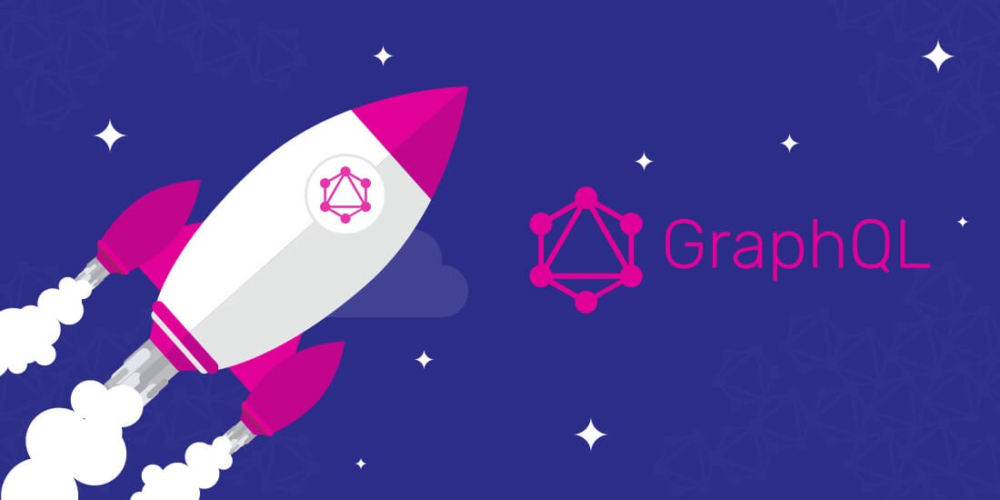

So you’ve been constructing and using REST API’s for quite some time now and short while ago started hearing about GraphQL — a new hype in the field of API technologies. Some says it’s good, some says it’s not. Well, I am pretty sure you all must be wondering about what this GraphQL fuss is all about and how it’s different from the traditional approach.

The purpose of this article is to highlight the major features associated with GraphQL along with discussing the significant pros and cons associated with this particular API specification.

GraphQL is usually described as a frontend-directed API technology as it allows front-end developers to request data in a much simpler way than ever before. Introduced by Facebook, the objective of this query language is to formulate client applications formed on instinctive and adjustable format, for portraying their data prerequisites as well as interactions. The best part is the language isn’t dependent on any specific database management system and is actually supported by your current data and coding.

One of the basic problems with conventional REST is the failure of the client to demand a personalized data set. In addition to that, running and controlling multiple endpoints is another difficulty as clients are mostly needed to request data from diversified endpoints.

While establishing a GraphQL server, it’s only important to have single URL for complete data procurement and alteration. Therefore, a user can request a dataset from a server by transferring a query string, mentioning what they need.

Before we proceed, here you can find our personal experience.

## GraphQL VS REST

While talking about the similarities, both REST and GraphQL are used for building API’s. Plus, both of them can be managed over HTTP.

As far as differences are concerned, REST is primarily a structural conceptualization for network-centric software, comes with no specification, and acquires no definite set of tools. It concentrates more on API’s durability rather than performance optimization.

GraphQL, on the other hand, is a query language devised to work over one endpoint through HTTP, upgrading performance and adaptability. I would even say that comparing query language and architectural style for developing web services may look strange :). Some of the other prominent differences include:

### Data Fetching
Data fetching is certainly one of the most compelling advancements introduced by GraphQL. In a standard REST API to yield or recover data, we might require to make requests to numerous endpoints. The GraphQL in comparison offers single endpoint via which we access data available on the server.

```bash
query {
  books {
    id
    title
    author
    isbn
    price
  } 
}
```
### Over or Under Data Fetching
It is considerably much straightforward to fetch more data than you need in REST than in GraphQL as each endpoint in REST specification includes a settled data formation. Similarly, with REST it’s comparatively easier to under fetch the dataset, enabling clients to make additional requests to get relevant data.

The case is quite different when it comes to GraphQL. Since it’s a query language and supports declarative data fetching, the users can only get what they actually need from the server.

### Select only book title and price:
```bash
query {
  books {
    title
    price
  } 
}
```
### Error Management
Error management in REST specification is quite simple. All we need to do is to inspect the HTTP headers to know a position of a response. Contingent upon the status code, we can quickly state the error as well as the suitable way to resolve it. On the other hand, we always receive a 200 OK status in case of GraphQL.
```bash
Request: query { books { error_field } }
Response:
Request Method:POST
Status Code: 200 OK
{“errors”:[{“message”:”Cannot query field \”error_field\” on type \”Book\”.”,”category”:”graphql”,”locations”:[{“line”:3,”column”:3}]}]}
```

### Caching
Since REST is enforced employing HTTP which already put caching into effect, you can use it to avert getting resources. GraphQL, on the other hand, has no caching system, thus leaving the users with the burden of handling caching on their own.

## GraphQL — Advantages

### Versioning
When there’s restricted data control that’s brought back from an API edge, any shift can be treated as a breaking change, and breaking variations need an updated version. This is perhaps the biggest reason why do most API’s opt for versioning. If including updated features to an API needs a latest version, then an adjustment appears between publishing frequently versus the interpreting and retention of the API.

GraphQL, in comparison, only rebounds the data that’s needed so recent facilities can be included through latest types and fields without triggering a breaking change.

### Deprecation Made Easy
While using GraphQL, you can conveniently deprecate a field. GraphQL users are bound to mention the fields they need in the query.
```bash
‘author_name’ => [
  ‘type’ => Type::string(),
  ‘deprecationReason’ => ‘Deprecated. Use author field’,
],
```
REST API works in a different manner. Although the base endpoint is accessible in all REST API’s, not all of them come with sparse fieldsets.

In comparison, GraphQL makes it incredibly effortless to monitor particular field usage. API holders can get across to the specific clients employing fields that are pulling out.

### Performance Optimization
While REST usually defaults to the entirety, GraphQL is generally the least possible request. Despite the fact that if REST API gives backs an elementary partial, there are more fragments being transmitted by default with GraphQL.

## GraphQL — Disadvantages

### Caching Isn’t Easy with GraphQL
Unlike REST which employs a stockpile of HTTP conventions that makes current clients and proxies work flawlessly to help both servers as well as the clients, GraphQL calls for entirely different approach. Definitely, things aren’t as easy as it were with REST as you’ve to rearrange your datasets, employ a collection of Redis and always need to pray that your clients are caching as well.

As explained clearly by [graphql.org](https://graphql.org/learn/caching/),
“In an endpoint-based API, clients can use HTTP caching to easily avoid refetching resources, and for identifying when two resources are the same. The URL in these APIs is a globally unique identifier that the client can leverage to build a cache. In GraphQL, though, there’s no URL-like primitive that provides this globally unique identifier for a given object. It’s hence a best practice for the API to expose such an identifier for clients to use.”

### Authorization Problems
Authorization problem is also an important concern that we require to pay attention to while working with GraphQL. Consider GraphQL as a domain specific language. It’s merely a single layer that we could place between the data service and our clients. Authorization is completely a separate layer and the language itself will not assist with the application or usage of verification or authentication. You can however make use of GraphQL to relate the entry tokens in between the clients and the plan in force. This is quite identical to the approach we follow in REST though.

## Detecting and Resolving n+1 Problems

### What are n+1 Issues?
n+1 problems are the most evident optimization concern one might face while drafting a GraphQL backend.

Incase you don’t optimize your GraphQL queries, you may end up with sending numerous round trips over the series of just one query. Without a proper caching or batching system, it’s easy for an unpretentious server to issue fresh database requests every time a field is determined. DataLoader is certainly the best possible solution that can intensely augment backend performance, specifically in GraphQL server.

It’s convenient to represent the n+1 problem with a simple example:
```bash
query {
 users {
    name
    education {
      degree
      year
    }
    age
    address {
      country
      city
      street
    }
  }
}
```
With REST APIS, it’s comparatively easier to assess, identify and resolve n+ 1 problem. The case is somehow different with GraphQL though. Fortunately, Facebook is developing one feasible fix for this issue — DataLoader.

## What is Dataloader?

DataLoader is primarily a utility that can be used by the user to read data and make it accessible to the GraphQL functions. We can use this utility to directly read the data from the record instead of relying on SQL queries.

### How It Works?
DataLoader basically makes use of a blend of batching as well as caching. It can be used to batchload the answers for multiple questions/requests asked by the client. Plus, it will also cache the replies and make them accessible for consecutive queries regarding the similar resources.

### Queries, Mutations, and Subscriptions in GraphQL
Okay, so we already highlighted some of the important aspects associated with GraphQL. But, to develop a fully functional app, we also need to have a look at some other ingredients that can be used to spice up the functionality and performance of your work in progress.

### Queries
As its name suggests, queries are data requests made by the client from the server. Dissimilar to REST where there is an evidently detailed format of data recurred from multiple endpoints, GraphQL only discloses single endpoint, enabling the client to determine what information it actually requires from a predefined framework.

For instance,
```bash
{
 Users {
   name
 }
}
```
The field ‘Users’ in the above mentioned query is known as the rootfield, while any data that comes after that is referred to as the payload.

This query will result in the names list of all the users.
```bash
{
  “Users”: [
  {“name”: “Damira”},
  {“name”: “Michael”}
  {“name”: “Salman”}
  {“name”: “Sara”}
  {“name”: “Maria”}
]
}
```
It’s noticeable that this query resulted in the user names (that’s because in our query, we’ve clearly specified that we need the list of names only). For any additional request, we need to add specific details for that.

For example, supposing we wish to access the information of only last 3 users from the list. We can employ arguments now to achieve this.
```bash
{
  Users (last: 3) {
    name
    username
}}
```
So, we’ve observed how to get data from the server by employing ‘queries’. It’s time now to have a look at the ways we can create, omit or update data in GraphQL.

### Mutations
Mutations are used to create, update or delete data. The structure is almost similar to queries except for the fact that you need to include the word ‘mutation’ in the beginning. For instance,
```bash
mutation {
  createUser (name : “John”, username: ”jo123”){
    name
    username
  }
}
```
### Subscriptions
Subscriptions can be used to set up and retain real-time link to the server. This allows you to get instant information regarding relevant events. Mostly, a client needs to subscribe to the particular event in order to get the corresponding data.

Please follow [http://graphql.org/learn/queries/](http://graphql.org/learn/queries/) for further details.

## Get the Best of Both Worlds

Although GraphQL solves a number of problems, it still has flaws and deficiencies. Validations or policies, and caching, for instance are just to name a few. Since it’s non-assertive in nature, it doesn’t direct its users about how to apply those layers. In addition to that, the presence of a non-concrete layer between the backend server and your clients could be extremely disturbing.

Do checkout a [guide](https://medium.com/apollo-stack/a-guide-to-authentication-in-graphql-e002a4039d1) provided by The Apollo Stack to find out the answers to some of your basic questions.

If you have a running project, it would be difficult for you to perform quick migration from original RESTful API to GraphQL approach. But, the good news is you can use both of these API technologies simultaneously to enjoy the best of both worlds.

For example, you can use GraphQL queries to start rebuilding your frontend to fetch data and only then start to integrate mutations. It will allow you to slowly reduce actions in your controllers.

Moreover, it’s also possible to keep these approaches working concurrently for the longer period for your projects. For example, if you want to simplify authorization mechanism, you can always take a help from the REST framework.

### Conclusion

To recall [SOAP](https://simple.wikipedia.org/wiki/SOAP_%28protocol%29) was the ultimate hype in the late 90’s and gained immense popularity and fame as a strong protocol specification for exchanging structured information in the application of web services in computer networks. However, the associated payloads are noticeably high and fragmentation of previous applications gave rise to disorientation and impediment.

The REST was introduced in response to the requirement for a more practical and adaptable approach to publish and utilize web services. The concept was cleverly straightforward and completely stateless, hence off-putting any irrelevant complication. In addition to that, this approach also landed with effortless blending with JSON and XML. But again, the unification of data was a biggest hurdle. Plus disagreement regarding how versions should be managed was another problem. To deal with this situation, Facebook came forward and provided developers a solution that offers the best of both worlds — GraphQL.

GraphQL isn’t the only solution without a concrete and practice-based explanation. RESTful API’s have a proven record of efficiency and performance for many years. GraphQL overshadows the lacking of REST, while REST fills the voids present in GraphQL.

Noticeably, the situation with GraphQL and REST is quite identical to the situation with relational and NOSQL databases.

While using GraphQL, HTTP is certainly the most preferred option for client-server protocol and that’s largely because of its pervasiveness. However, the performance is questionable when it comes to serving over HTTP 2.

Although GraphQL solves quite a few problems that we have, it still would be difficult to choose any one API specification as you should most probably have both at some point.

From design and application to pricing and overall functionality, selecting an API framework will have an effect on the complete API process. Thus, this selection must be a knowledgeable one and not formed on just elementary beliefs.

This post is entirely based on our personal experiences with both these approaches. We would love to hear back your opinions or comments about GraphQL and RESTful API’s.

## Some Useful Publications
https://github.com/weblab-technology/graphql-example
[Implementing GraphQL as a Query Language for Deductive Databases in SWI-Prolog Using DCGs, Quasi Quotations, and Dicts](https://www.researchgate.net/publication/311989237_Implementing_GraphQL_as_a_Query_Language_for_Deductive_Databases_in_SWI-Prolog_Using_DCGs_Quasi_Quotations_and_Dicts)

[REST and Web Services — In Theory and in Practice — Springer](http://www.springer.com/cda/content/document/cda.../9781441983022-c1.pdf?SGWID)